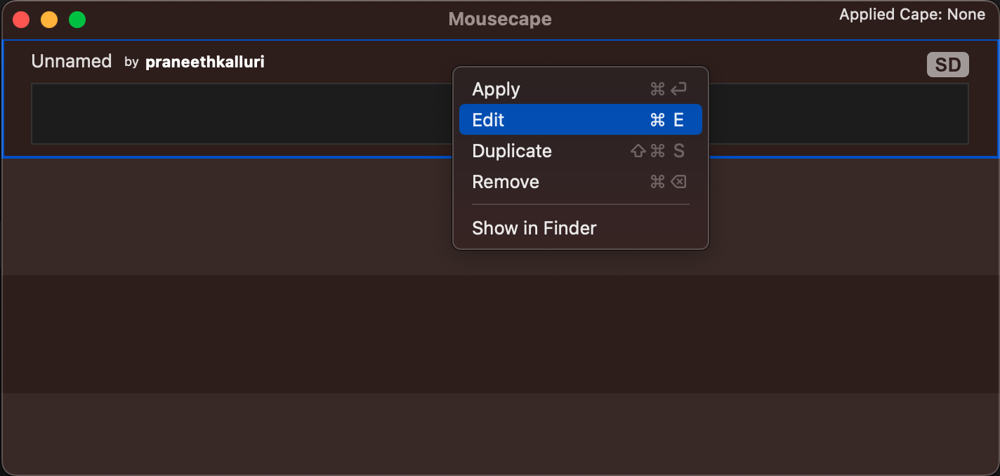
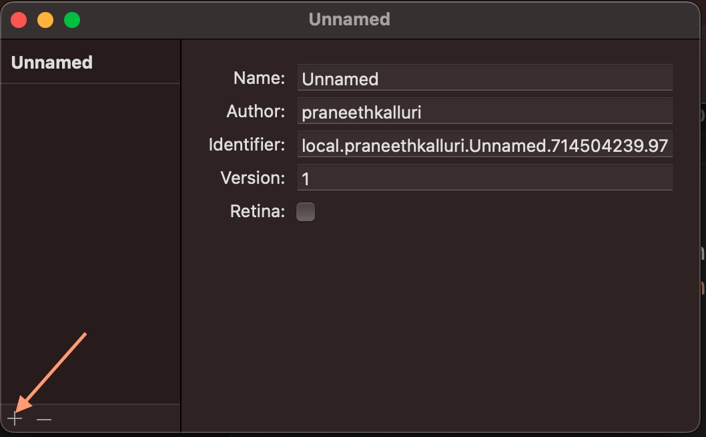
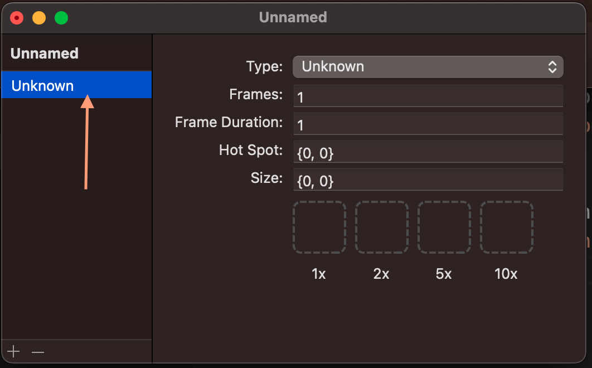
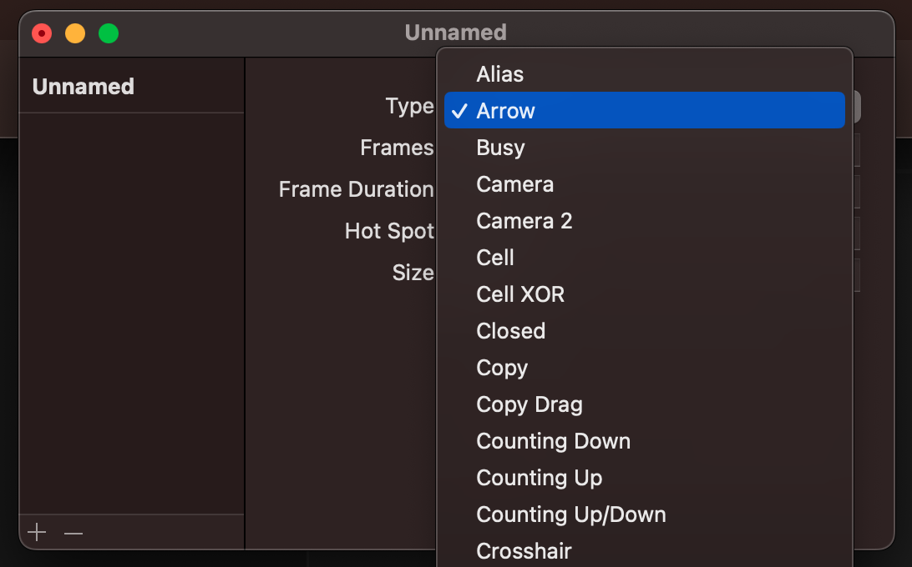
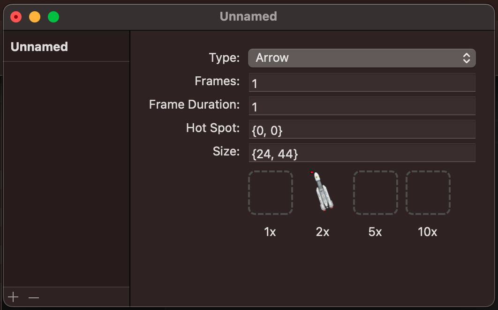
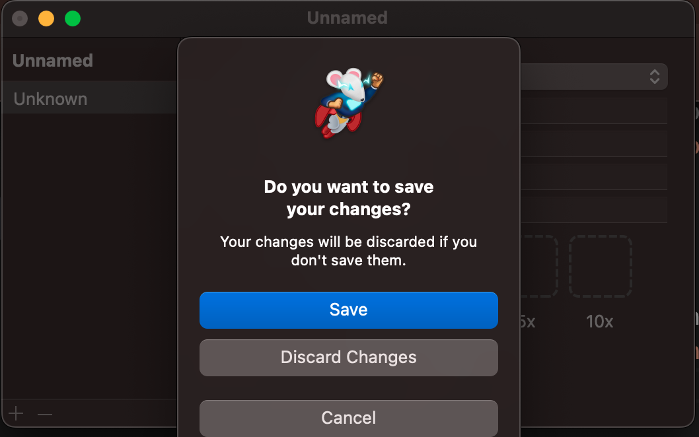
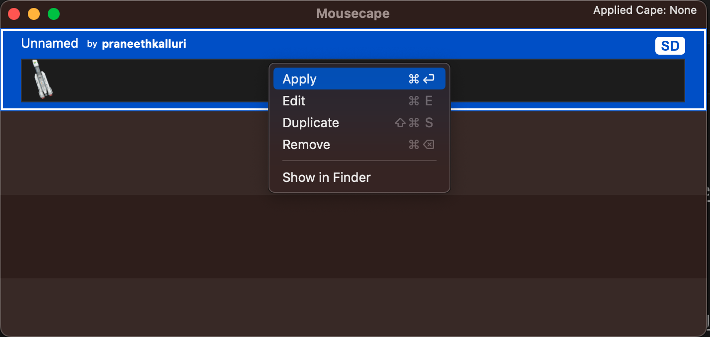

📥 **1** Download `pslv_icon.png`

📥 **2** Download `Mousescape.zip` 
[🔗 Download Link](https://github.com/alexzielenski/Mousecape/releases/download/1813/Mousecape_1813.zip)

🛠 **3** Install `Mousescape.app`

🚀 **4** Open Mousescape > Cmd+N

🖱 **5** Right click on the cape > Edit

➕ **6** Press + Symbol on Bottom left

👆 **7** Select the newly added cape

🔽 **8** Select Arrow Type from Dropdown

🖱➡📦 **9** Drag and Drop `pslv_icon.png` to x2 box

💾 **10** Save the Changes

🖱🚀 **11** Right click on the cape and select Apply

🎉 **Congratulations!** You now have the PSLV rocket as your Mac Cursor Icon 🚀💻
